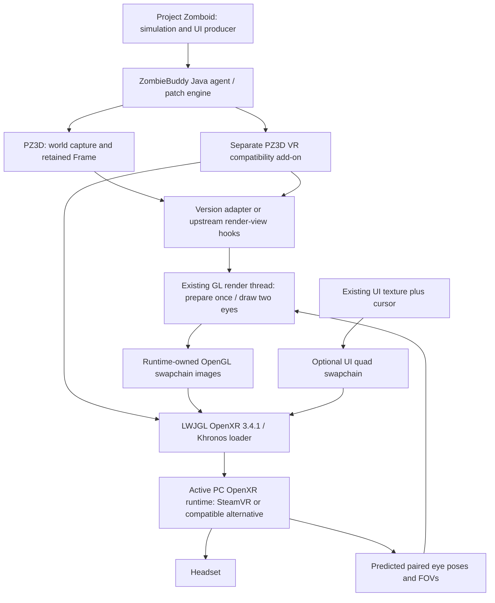

# Compatibility add-on, risks, and proposed first implementation phase

**This proposal is not implemented.** The investigation ends here; only a later explicit user approval should start prototype work. In-game tests belong to the user.

## Can it remain a separate mod?

Yes, plausibly, but a clean supported API does not exist in this installed build. ZombieBuddy appends Java mods to the system classloader and can transform PZ3D classes as well as vanilla classes. `Renderer.Frame` and `RetainedRender` are public, and `Frame.render/draw/postRender` are public. Important collaborators (`Camera`, `ViewMath`, `FrameLease`, `UiLayer`, `SceneUpload`) and frame fields are package-private; the render target fields and `Frame.ad()` are private. Full access flags and JVM descriptors are saved in the class-signature JSON files.

| Approach | What would be required | Maintenance assessment |
|---|---|---|
| Separate add-on using ZombieBuddy Advice + a small version adapter | Patch PZ3D Frame consumer, private prediction/scene/effect/shadow helpers, projection and dimensions; reflectively read/access fields; manage one stereo invocation guard | Plausible for a pinned proof, but many internal hooks and obfuscated names. Validate target hashes/signatures and disable on mismatches. Cross-mod advice ordering must be tested. |
| Separate add-on plus upstream PZ3D rendering hooks | Public leased frame token, once-per-presentation preparation, pure per-view draw with explicit full matrix/eye/target/size/time, UI capture access, pacing override | Preferred sustainable architecture. Public API surface can be small, but separating the current draw method internally is meaningful work, not a one-line hook. |
| Permanent fork | Own renderer split and integration with no runtime patch weaving | Maximum control, substantial recurring merges across a fast-moving partially obfuscated renderer. Not shown to be unavoidable. |

Reflection could read `UiLayer.texture`, invoke `Frame.ad`, or access private target fields on this unnamed-module classpath, subject to actual classloader/access validation. It cannot intercept the middle of `draw`, preserve resource generations by itself, or solve coupled motion/shadow effects. Do not build a long-term solution around rewriting `final` fields. A same-package helper is technically conceivable under the same loader but creates another fragile dependency on internal names.

The add-on would need access to:

- `Renderer.Frame` captured scene, lease, actor/vehicle poses and lighting; `RetainedRender` frame availability/generation.
- `SceneUpload.advance/step`, frame `ad`, `LookState`, `MotionPrediction`, `VehicleRenderer.update` and effects clocks to freeze non-eye state.
- `ViewMath.projection`, frame eye fields, `Renderer.f`, desktop size reads and final blit destination to inject eye matrices/targets.
- `WorldBuffers.beginView`, shader uniform consumers and scratch effects targets to refresh view-dependent state.
- `UiLayer` texture and dimensions, plus the completed native UI boundary and cursor state.
- `RenderThread` scheduling and `RetainedRender.begin/end/repeat` so there is exactly one OpenXR submit per headset frame.

No dependency on modifying ZombieBuddy itself was established. A new add-on must still satisfy ZombieBuddy's normal JAR policy/signing/development workflow. No policy changes were made here.

## Proposed architecture

## Risk categories

| Category | Findings |
|---|---|
| Confirmed feasible from code | Perspective 3D rendering; GL color/depth framebuffer; shaders accepting combined matrices; retained frame redraw; snapshot/resource leasing; UI-to-texture copy; runtime patch infrastructure targeting non-vanilla packages. These are code capabilities, not confirmed VR operation. |
| Likely feasible | Sequential stereo from one prepared scene; head rotation/limited translation; matching LWJGL OpenXR module; using existing WGL context; copy into runtime images; virtual-monitor UI; version-bound separate add-on. |
| Unknown without prototype | Actual native linkage, runtime extension/GPU compatibility, headset detection, GL state restoration completeness, per-eye visual correctness, resource lifetime under load, stable user input, comfort/latency and frame rate. |
| Major obstacles | No pure per-eye draw API; render-time scene adoption and mutable prediction/effects/shadows; fixed-up-vector camera and desktop dimensions; 60 Hz retained pacing plus desktop presentation; body/aim/head coupling; partial UI capture and cursor handling. |
| Potential blockers | Runtime lacks OpenGL extension or cannot use game's GPU/context; render integration cannot meet coherent two-eye ownership without large changes; sustained CPU/GPU latency unacceptable even with simple reductions; internal patch maintenance becomes untenable without upstream support. None was proven insurmountable by this static inspection. |

The absence of runtime registration is a setup gap. It is not evidence that the PZ3D renderer is incompatible with OpenXR. The hardware log is not a performance guarantee. Existing PZ3D single-player and supported-version restrictions remain the starting boundary.

## Exact first-phase scope, after approval

Deliver one opt-in, version-pinned, reversible Java compatibility add-on, initially for **42.20.4 / PZ3D 0.2.2 / ZombieBuddy 2.3.2, Windows x64, single player, on foot, first person**. Keep keyboard/mouse control and existing gamepad behavior where it already works. Do not add motion controllers, hands, physical melee, VR inventory, multiplayer, room-scale locomotion, third-person VR, scoped zoom or vehicle-camera support in this proof.

Work in gated milestones within that future implementation, with reviewable packages for the user's tests:

1. **Runtime/context diagnostic.** Resolve the version-matched module, initialize loader/instance/system and an OpenGL session on the game render thread; enumerate capabilities/formats/view sizes, log runtime and GPU requirements, submit a diagnostic image, and recover cleanly when unavailable. No game renderer stereo yet. Success: headset receives the intended image and disabling the feature returns to ordinary PZ3D.
2. **Deterministic two-view renderer proof.** Split/freeze non-eye preparation; render two known synthetic camera offsets from a single retained frame into separate textures. Capture labeled eye images, scene/generation IDs, body/vehicle transforms, effect time, palette fingerprints and lease counters. Success: consistent simulation state, correct parallax/occlusion, no double retirement and no desktop state corruption. This is diagnostic stereo, before trusting headset pose mapping.
3. **Tracked OpenXR stereo.** Use one `xrLocateViews` result pair at predictedDisplayTime; full orientation including roll; runtime asymmetric FOV; scaled eye translations; copy into acquired images and submit one stereo layer. Add recentering and conservative small positional motion. Success: stable world under yaw/pitch/roll, correct eye order/scale, body remains conventionally controlled.
4. **Minimal readable existing UI.** One complete UI capture, visible mouse cursor, floating quad at adjustable size/distance; existing inventory/mouse input. Suppress incorrect mono overlays until separately mapped. Success: user can open, read, click and close inventory without duplicate events or unwanted body turning.
5. **Lifecycle and performance gate.** User exercises pause/unpause, scene transitions, PZ3D toggle, window resize/minimize, headset focus loss/session stop, exit and reentry. Measure pair GPU/CPU times, queue age and misses at two render scales in a sparse and a busy scene; report measured results and remaining issues. Avoid a separate third world render for the desktop mirror.

If runtime/context integration fails, stop renderer work and diagnose that boundary first. If deterministic stereo cannot be established with a bounded adapter, request/prepare an upstream rendering contract before expanding functionality. A full renderer fork is a decision after that evidence, not the initial assumption.

Acceptance requires both eye views from the same captured simulation state and frozen presentation state, correct asymmetric projections and pose submission, no double update/cleanup, functioning conventional controls/UI, and clean fallback. Rendering twice without these properties is not a successful VR prototype.
