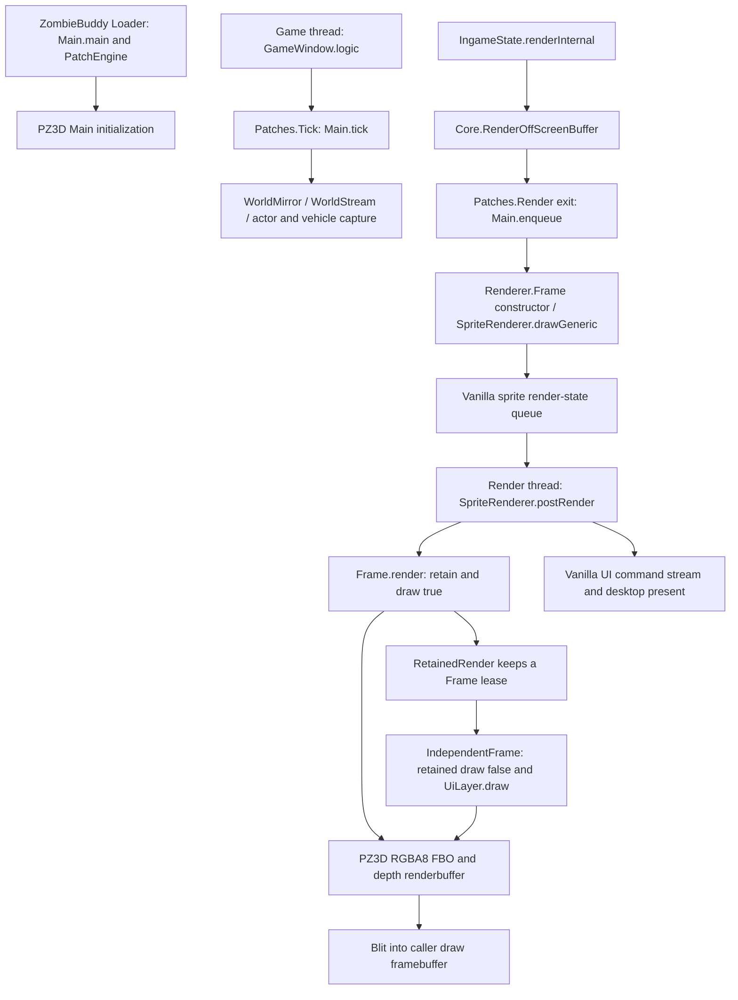

# Installed PZ3D rendering and camera map

Unless qualified otherwise, class names below are in `com.pavelvoronin.pz3d`; source paths resolve beneath [`reference/pz3d/vineflower/com/pavelvoronin/pz3d`](../reference/pz3d/vineflower/com/pavelvoronin/pz3d). Vanilla reference is beneath `reference/project-zomboid/decompiled`. Obfuscated fields/methods such as `nw`, `ad`, and `f` are the actual installed names, confirmed by the bytecode signature index.

## Entry and thread boundaries



`Patches.Tick` wraps private `zombie.GameWindow.logic()V`: enter calls `DeferredLoot.frameBegin`, `Diagnostics.gameBegin`, `Main.logicBegin`; exit calls `Main.logicEnd`, `Main.tick`, and paired cleanup. `Main.tick()` performs input/control integration, camera/world updates, and frame retirement. It must continue once per game update.

`Patches.Poll` exits `zombie.input.GameKeyboard.poll()V` into `Input.poll()`. `LookState.turn(double,double)` stores current mouse look in a volatile `LookState.View(yaw,pitch,sequence)`. This state can change independently of a captured render frame.

The normal rendering hook is `Patches.Render.exit()` on **`zombie.core.Core.RenderOffScreenBuffer()V`**. It calls `Main.enqueue()V`, which constructs **`Renderer.Frame(WorldMirror.Scene, Controller, IsoPlayer)`** and submits it with `SpriteRenderer.instance.drawGeneric(TextureDraw.GenericDrawer)`. This is command production, not the place to call OpenXR GL functions directly.

Vanilla `RenderThread.lockStepRenderStep()Z` acquires a `SpriteRenderState`, executes `SpriteRenderer.instance.postRender()`, and calls `Display.update(true)`. `Renderer.Frame.render()V` executes within this consumer path, calls `RetainedRender.accept(this)`, and then `draw(true)`. `GenericDrawer.postRender()` is resource lifecycle work, not a second rendering entry point.

`Patches.IndependentFrame` wraps private `RenderThread.lockStepRenderStep`; `RetainedRender.begin/end` can redraw the retained frame when no newer frame arrived. `Patches.IndependentWait` overrides private `RenderThread.waitForRenderStateCallback()Z` to stop waiting when a retained frame is available. `RetainedRender.repeat(Runnable)` binds framebuffer 0, calls retained `draw(false)`, draws the retained UI, then invokes desktop presentation. `RetainedRender.begin()` uses a **16,666,667 ns** interval: the independent path is paced around 60 Hz, unsuitable as the unmodified VR scheduler.

## How the isometric game becomes a perspective scene

PZ3D reconstructs a local 3D representation from the live world and its assets. It does not merely change `IsoCamera`'s projection and redraw vanilla sprites.

| Area | Actual classes/methods and behavior | VR implication |
|---|---|---|
| World extraction | `WorldMirror.refresh`, `update(float,float,float,...)`, `scene()`; `WorldCaptureGeometry`; `WorldStream`; `WorldSession`; `WorldMirror.Scene` records | Reuse one scene version and origin for both eyes. World radius constant is 64; capture/streaming boundaries remain limitations. |
| Geometry | `WorldGeometry.forScene(Scene)`; `WorldBuffers.shared`, `stage`, `sync`, `beginView`; `Ground`, `WallMaterials`, `Geometry` | Meshes and textures are reusable across eyes; draw visibility lists are view-dependent. |
| Buildings/interiors | `BuildingSubsystem.observe/update`, `BuildingGeometry`, `BuildingMap`, `RoofSubsystem`, `Roofs`, `WorldCaptureGeometry`; `Enclosure.capture/upload` | Buildings/roofs are part of reconstructed geometry, with room/enclosure lighting. Keep snapshots fixed; validate indoor head movement and near-wall visibility. |
| Native isometric suppression | `NativeWorldRender.skip/skipFbo/skipPreparation`, enabled from client settings; `Patches.HiddenFboWorld` on `FBORenderCell.performRenderTiles`, `HiddenLegacyWorld` on `IsoCell.performRenderTiles`, and `NativeIsoPrepare*` patches | Preserve PZ3D's suppression policy. Do not reenact all vanilla world passes twice. Suppression requires active/nonfailed PZ3D, `Renderer.presented`, and one player. |
| Actor admission | `ZombieModels.update(float,float,float)`, `visible`, `interceptCull`; `Patches.ModelVisibility` patches `IsoGameCharacter.setSceneCulled(Z)V` | Keeps models alive near the player, rather than relying only on isometric screen visibility. Current list capped at 128 zombies; radius 64 and vertical difference <7.34847. Capture once. |
| Character skinning | `Renderer.Frame` constructor, private `a(CharacterDraw,ModelInstance,AnimatedModelInstanceRenderData,Matrix4f,int)`; `PoseData.acquire/initModel`; `Renderer.Part` and `CharacterDraw` | Captures pose matrices and reference-counts native resources. Reuse matrices, never reacquire/advance animation per eye. |
| Player body | `Camera.eyes`, `Camera.aimCorrection`, `BodyRig`; `Frame.ad()` adjusts captured body parts for render-time look | Current look also rotates the first-person body/weapon transform; headset look must be separated from this body aiming behavior. No new VR hand models needed. |
| Vehicles | `VehicleRenderer.capture`, `update(List<Draw>,Scene,long,long)`, `draw`, `glass`, `shadows`, `lights`; `VehicleMotion`, `Vehicles.Rider` | Prediction changes transforms at draw time. Run once per stereo pair; view/render eye position still changes per eye. Vehicle camera has separate look limiting logic. |
| Terrain/props/trees | `Renderer.a(...)` overloads for ground, items and props; `TreeRenderer.prepare/draw` | Ground and billboard-like item representations need stereo inspection. Tree asset preparation is budgeted and should not reveal assets in only the second eye. |
| Lighting | `Lighting.capture(IsoPlayer)` reads game time/climate/traits; `Lights`, `Torch.capture/predict/render/upload`, `Enclosure` | Frame captures lighting, but camera-following torch prediction and render-side shadow updates need once-per-pair treatment. |
| Shadows | `ShadowMap.prepare/render/stage/commit`, `PointShadows.render`, `ActorShadows.render`, `ContactShadows.capture/draw`; `DepthCopy` supports copy-image or FBO fallback | Incremental caches and frame counters mutate. Use common center-view shadow selection for an initial pair; share results only after consistent preparation. |
| Shaders | `Renderer.initialize/program/source`; packaged `scene.vert/.frag`, `skin.vert`, `static.vert`, `model.frag`, `ground.*`, `effects.*`; tree, vehicle, sky, shadow shaders | Most draw calls accept a combined `viewProjection`; update this plus `eye`, `viewportSize`, culling and dependent uniforms per eye. |
| Native shader adaptation | `NativeModelShaders.remember/reuse`, `Patches.PublishModelShader` and `ReuseModelShader`; `ShaderPrograms.initialize` cache | PZ3D supplies its own shaders and caches/reuses native model shader objects. No installed shader file edits are needed for the research or proposed add-on approach. |
| Post effects | `TargetOutline.draw`, `ObjectHighlightRenderer.draw`, crosshair/effects drawing, `DeviceCaptionLayer.draw`, `ChunkDebug.draw` | These are actual extra view-dependent passes, some with private scratch FBOs. No general stereo-aware post-processing abstraction was found. |
| UI | `UIManager.uiFbo/useUiFbo`, `UiLayer.capture/draw`, `RetainedRender.enter` | Existing texture capture is useful; complete HUD coverage requires auditing cursor, captions and text drawn outside the UI FBO. |

## Camera and matrices

`Controller` exposes public `x,y,z,yaw,pitch,height,standingEye,eyeLift` fields. Default `height=1.7`, `standingEye=1.32`. World Z uses a floor conversion of **2.44949 units per vanilla floor**; this is not evidence that every world unit equals a physical meter.

`Camera.eyes(Controller)` starts from `NativeAvatar.eye`, or a vehicle seat transform, then applies camera tuning offsets. `Camera.view(Controller)` returns `Camera.View(Vector3f origin, Vector3f direction, boolean sights)`. First person uses eyes plus controller direction; third person uses `thirdOrigin`, shoulder framing, orbit distance, and `InteractionIndex.cameraRay` collision. Camera distance defaults to 1.4, bounds 0.45–3.0 unless settings override. `Camera.Key` and static cached origin `aY` assume one active view.

Direction is `(cos(yaw)*cos(pitch), sin(yaw)*cos(pitch), sin(pitch))`. There is no roll in `Controller` or `Camera.View`. Changing direction alone cannot represent headset roll.

[`ViewMath.projection`](../reference/pz3d/vineflower/com/pavelvoronin/pz3d/ViewMath.java) actually constructs a **combined projection-view-coordinate conversion**, despite its name:

```text
perspective(fov, aspect, near=0.02, far=160)
  * lookAt(x,-y,z, x+dx,-y-dy,z+dz, up=(0,0,1))
  * scale(1,-1,1)
```

`ViewMath.FOV` is 78 degrees in radians. `fieldOfView(aim)` reduces it by 12 degrees; the magnification overload narrows it further using tangent/atan. `Frame.fov` captures `Main.fieldOfView()`. `Frame.handFov` exists but no use in the inspected drawing body was found; do not infer a separate hand rendering pass from that field alone.

`Frame` stores origin relative to `Scene.ox/oy/oz`. Private `Frame.ad()V` recomputes render-time camera/motion, overwriting `x/y/z/dx/dy/dz`, and rebases model transforms. It uses `LookState.vehicle`, `MotionPrediction.update`, `VehicleRenderer.update`, body fade, recoil, and torch prediction. The final draw then builds the matrix via `ViewMath.projection(FFFFFFFF)Matrix4f`.

VR needs a full orientation/quaternion and runtime asymmetric eye projection. Replace the combined matrix at a defined eye-render boundary; also supply eye position to lighting/reflections, sky, glass, contact effects, and frustum tests. Do not globally patch JOML `perspective` or OpenGL uniform calls: shadow maps and other projections share those APIs.

## Actual draw sequence and targets

Read `Renderer.Frame.draw(boolean)` in the preferred decompilation starting around line 1010. The boolean distinguishes fresh/native preparation from retained drawing; it is **not** a left/right eye selector or an immutable replay flag.

1. Check active state/generation; sample `System.nanoTime`; read desktop framebuffer width/height.
2. Save viewport, draw/read FBO bindings, program, VAO, array/renderbuffer bindings, active texture and multiple texture bindings; push GL attributes.
3. `Renderer.initialize()` and private `Renderer.f(int,int)` allocate/resize one global render target.
4. Advance pending scene uploads; `Frame.ad()` predicts pose; refresh enclosure; prepare trees and sun shadows; update stream fade; optionally capture UI.
5. Run texture work and, for fresh frames, prepare actor/vehicle resources.
6. Update sun, point, torch, actor shadow systems and streaming lead.
7. Bind `Renderer.nw`, set viewport and depth state; clear color/depth; create combined view-projection; draw sky and upload lighting uniforms.
8. Sync world buffers when `Renderer.ny != scene.version`; update frustum `Renderer.nn`; call `WorldBuffers.beginView()`.
9. Optional `DepthPrepass.begin` draws depth, then opaque world/terrain, items, trees, props, vehicles, actors, outline passes, contact shadows, cables, transparent surfaces and vehicle glass.
10. Draw object highlighting, current tracers, crosshair/interaction dot, debug geometry and device captions.
11. Blit color from `Renderer.nw` to the **draw FBO bound on entry**, using desktop framebuffer dimensions. Set `Renderer.presented`; update timing/FPS counters.
12. End depth/timing queries and restore GL state in finally blocks.

The target allocator uses private static fields:

| Field | Meaning verified from allocator |
|---|---|
| `nw` | Main framebuffer name |
| `nx` | `GL_TEXTURE_2D` color texture, `GL_RGBA8` (32856) |
| `depth` | Renderbuffer, `GL_DEPTH_COMPONENT24` (33190) |
| `width`, `height` | Current target dimensions, taken from desktop Display framebuffer |
| `nn` | Shared JOML frustum |
| `nm` | Shared `WorldBuffers` |

The allocator creates non-multisampled storage, linear texture filters, and checks FBO completeness. Main render uses depth `LEQUAL`, depth range 0–1, resets blend/cull/scissor/stencil/alpha/polygon state, and clears depth every draw. A single scratch FBO can be reused sequentially **if the first eye is copied out before the second overwrites it**. Concurrent eye drawing is unsafe with these shared globals.

`TargetOutline` and `ObjectHighlightRenderer` have separate scratch targets keyed by dimensions. `DepthCopy` serves shadow depth copying; it is not an existing OpenXR submission facility. Desktop blitting is not color-managed OpenXR presentation: format, sRGB conversion, orientation, sample count, and image extent need explicit handling.

## Vanilla state that should not be replayed per eye

`IngameState.renderInternal()` changes `IsoPlayer` singleton, `IsoCamera.frameState`, `IsoSprite.globalOffsetX`, highlight flags, text and UI passes. `IsoWorld.render()` invokes model atlases, cell rendering and additional systems. `Core.EndFrameUI()` changes blink alpha and UI render accumulators, ends ImGui, and signals `RenderThread.Ready()`. `UIManager.render()` calls `UITransition.UpdateAll()` and Lua pre/post UI callbacks. `SpriteRenderer` consumes queued render states and retires generic drawers. These are not two-eye-safe entry points merely because they contain the word render.

The practical interception level is therefore the **PZ3D retained `Renderer.Frame` consumer on the existing render thread**, with the native producer and UI logic left at their normal cadence.

`NativeWorldRender.skipFbo()` also does necessary native bookkeeping while suppressing tiles: `FBORenderChunkManager.startFrame`, corpse/item cache updates, cache submission, render-chunk lock release and shadow-list clearing. Bypassing this entire producer path would discard that bookkeeping. Replaying it for each eye would duplicate it.

PZ3D also changes gameplay input/interaction routing, not just rendering. The copied `common/media/lua/client/PZ3D.lua` registers `OnPZ3DAction/Mode/Container/Context/Pickup/Map/VehicleInput`, adapts inventory transfers/drop offsets and drives existing timed actions/UI. Related Lua files handle sidebar, options, vehicles, visuals and interaction. Keep these existing event paths single-execution; a viewing-only VR layer should not emit duplicate actions. `Patches.NativeLocomotion*`, `Combat*`, `Pointer*` and `VehicleControls` identify the corresponding native interception points in the patch inventory.
